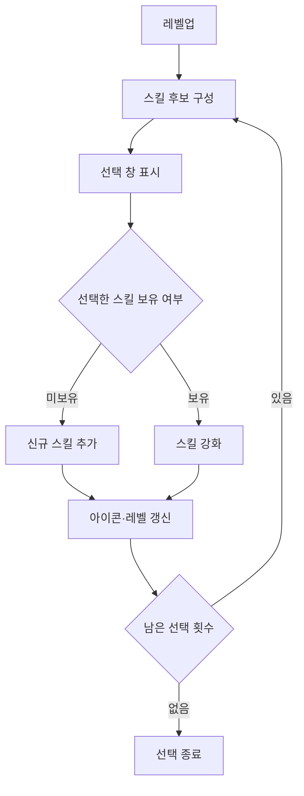

# The Battle Front

**Unreal Engine 5.1 · C++ 기반 멀티플레이 슈팅 배틀로얄**

몬스터를 처치해 성장하고, 레벨업마다 스킬을 선택하며 마지막까지 살아남는 것을 목표로 하는 팀 프로젝트입니다. 슈팅 전투에 무작위 스킬 선택과 강화 요소를 결합했습니다.

[상세 포트폴리오](https://pickled-saver-987.notion.site/The-Battle-Front-2fd23b8d49dc8050a6c4fe654410f53c?pvs=143) · [클라이언트 코드](TheBattleFront/Source/TheBattleFront) · [서버 코드](Server) · [日本語](README.JP.md)

## 프로젝트 정보와 담당 범위

| 항목 | 내용 |
| --- | --- |
| 개발 기간 | 2024.03 ~ 2024.06 |
| 팀 구성 | 서버 프로그래머 1명 + 클라이언트 프로그래머 2명 |
| 담당 | 캐릭터, 스킬, UI, 무기 |
| 엔진 / 언어 | Unreal Engine 5.1 / C++ |
| 플랫폼 | Windows |

이 문서는 팀 프로젝트 중 **담당한 캐릭터·스킬·UI·무기와 해당 기능의 클라이언트 연동**을 중심으로 설명합니다. 서버와 AI·게임 진행 코드는 별도 경로에서 확인할 수 있습니다.

## 게임 화면

| 전투 화면 | 스킬·전투 화면 |
| --- | --- |
|  |  |
| **월드맵·미니맵** | **결과 화면** |
|  |  |

## 담당 구현 요약

| 영역 | 주요 구현 | 대표 코드 |
| --- | --- | --- |
| 캐릭터 | 이동, 마우스 방향 조준, 카메라 제어, 체력·경험치·레벨 관리 | [CharacterController.cpp](TheBattleFront/Source/TheBattleFront/Character/CharacterController.cpp), [GameCharacter.cpp](TheBattleFront/Source/TheBattleFront/Character/GameCharacter.cpp) |
| 무기 | 발사 위치·방향 계산, 투사체 생성, 충돌 피해와 발사 효과 | [Weapon.cpp](TheBattleFront/Source/TheBattleFront/Weapon/Weapon.cpp), [Projectile.cpp](TheBattleFront/Source/TheBattleFront/Weapon/Projectile.cpp) |
| 성장·스킬 | 무작위 선택지, 신규 습득·강화, 종류별 자동 발동 | [AbilityManager.cpp](TheBattleFront/Source/TheBattleFront/Ability/AbilityManager.cpp) |
| 개별 스킬 | 폭격, 드론, 독성 구역, 수류탄, 회복, 보호막 | [Ability 폴더](TheBattleFront/Source/TheBattleFront/Ability) |
| UI | 체력·경험치·스킬 표시, 선택 창, 보호막, 월드맵 전환 | [HUDWidget.cpp](TheBattleFront/Source/TheBattleFront/Widget/HUDWidget.cpp), [SkillWidget.cpp](TheBattleFront/Source/TheBattleFront/Widget/SkillWidget.cpp) |
| 클라이언트 연동 | 이동·발사·스킬 패킷 송신과 수신 상태의 캐릭터 반영 | [CharacterController.cpp](TheBattleFront/Source/TheBattleFront/Character/CharacterController.cpp), [GameCharacter.cpp](TheBattleFront/Source/TheBattleFront/Character/GameCharacter.cpp) |

## 1. 캐릭터 이동·조준·카메라

`ACharacterController`에서 Enhanced Input 액션을 연결하고, `AGameCharacter`에 이동과 전투 명령을 전달합니다.

- **카메라 기준 이동:** SpringArm의 회전을 기준으로 전방·우측 벡터를 구해 이동 입력에 적용합니다.
- **마우스 방향 조준:** 마우스 위치를 월드 좌표와 방향으로 변환한 뒤 Line Trace를 수행하고, 결과 위치를 바라보도록 캐릭터의 Yaw를 설정합니다.
- **발사 간격 제어:** 발사 가능 여부와 쿨타임을 확인한 뒤 무기의 사격을 실행합니다.
- **카메라 제어:** 캐릭터 추적용 SpringArm의 분리·재부착, 화면 가장자리 이동, 회전과 초기화를 처리합니다.
- **캐릭터 성장:** 레벨별 데이터의 차이를 체력·공격력·방어력 등의 수치에 반영하고 UI를 갱신합니다.

**관련 코드:** [CharacterController.cpp](TheBattleFront/Source/TheBattleFront/Character/CharacterController.cpp) · [GameCharacter.cpp](TheBattleFront/Source/TheBattleFront/Character/GameCharacter.cpp)

## 2. 무작위 스킬 선택과 강화

경험치 획득, 레벨업, 스킬 선택, HUD 갱신을 하나의 성장 흐름으로 연결했습니다.

1. `ExpUp()`에서 경험치를 누적하고 필요 경험치를 넘으면 레벨업을 처리합니다.
2. `SetNewLevel()`에서 캐릭터 수치를 갱신하고 스킬 선택지를 준비합니다.
3. `AbilityManager::SetRandomIndex()`에서 보유 스킬과 강화 가능 여부에 따라 후보를 구성합니다.
4. 선택한 스킬을 보유하지 않았다면 새로 추가하고, 이미 보유했다면 레벨을 올립니다.
5. 스킬 아이콘과 강화 단계를 갱신하고 선택 창을 닫습니다.

후보는 중복 없이 최대 세 개를 표시하는 구조이며, 네 개를 보유한 이후에는 보유 스킬 중 강화 가능한 항목에서 선택하도록 분기합니다. 한 번의 경험치 획득으로 여러 번 레벨업한 경우에는 `LevelUpCount`를 통해 남은 선택 횟수를 처리합니다.

**관련 코드:** [GameCharacter.cpp](TheBattleFront/Source/TheBattleFront/Character/GameCharacter.cpp)의 `ExpUp()`, `SetAbility()` · [AbilityManager.cpp](TheBattleFront/Source/TheBattleFront/Ability/AbilityManager.cpp)의 `SetRandomIndex()`, `SetNewAbility()`, `AbilityLevelUp()`

## 3. 공통 기반과 개별 동작으로 구성한 스킬

`AAbilityBase`에 종류, 레벨, 쿨타임, 아이콘과 공통 함수를 정의하고, 파생 클래스에서 각 스킬의 동작을 구현했습니다. `AAbilityManager`는 보유 목록과 발동을 관리합니다.

| 스킬 | 동작 | 코드 |
| --- | --- | --- |
| 폭격 | 플레이어 주변 무작위 위치의 상공에서 생성되어 충돌 시 범위 피해 적용 | [AbilityBomb.cpp](TheBattleFront/Source/TheBattleFront/Ability/AbilityBomb.cpp) |
| 드론 | 주변 지점으로 이동해 범위 공격, 거리 조건에 따른 복귀 처리 | [AbilityDrone.cpp](TheBattleFront/Source/TheBattleFront/Ability/AbilityDrone.cpp) |
| 독성 구역 | 일정 시간 유지되는 영역을 생성하고 주기적으로 내부 대상에 피해 적용 | [AbilityChemical.cpp](TheBattleFront/Source/TheBattleFront/Ability/AbilityChemical.cpp) |
| 수류탄 | 투사체 충돌 후 별도의 화염 영역 생성 | [AbilityGranade.cpp](TheBattleFront/Source/TheBattleFront/Ability/AbilityGranade.cpp) |
| 회복 | 주기적인 체력 회복과 최대 체력 제한 | [AbilityHeal.cpp](TheBattleFront/Source/TheBattleFront/Ability/AbilityHeal.cpp) |
| 보호막 | 보호막 수치를 충전하고 관련 UI·이펙트 갱신 | [AbilityProtected.cpp](TheBattleFront/Source/TheBattleFront/Ability/AbilityProtected.cpp) |

드론은 `Search`, `Attack`, `Return` 등의 상태와 부착 여부를 사용해 행동을 구분합니다. 범위형 스킬은 생성 개수·위치·피해량을 설정하고, 회복과 드론의 주기적 실행에는 타이머를 사용합니다.

**관련 코드:** [AbilityBase.h](TheBattleFront/Source/TheBattleFront/Ability/AbilityBase.h) · [AbilityManager.cpp](TheBattleFront/Source/TheBattleFront/Ability/AbilityManager.cpp)

## 4. 무기·투사체와 전투 피드백

`AWeapon::Shot()`은 발사 지점의 위치와 회전을 이용해 투사체를 생성하고, 소유자와 충돌 활성 상태를 설정합니다. 발사 이펙트도 같은 흐름에서 처리합니다.

`AProjectile`은 `UProjectileMovementComponent`로 이동하며, Overlap 이벤트에서 소유자를 제외한 대상에 피해를 적용합니다. 충돌 후 또는 수명이 끝났을 때 제거됩니다.

캐릭터는 피해·체력 변경 결과를 체력바와 데미지 표시 UI에 반영하고, 발사·레벨업·스킬 사용에 사운드와 파티클을 연결합니다.

**관련 코드:** [Weapon.cpp](TheBattleFront/Source/TheBattleFront/Weapon/Weapon.cpp) · [Projectile.cpp](TheBattleFront/Source/TheBattleFront/Weapon/Projectile.cpp) · [GameCharacter.cpp](TheBattleFront/Source/TheBattleFront/Character/GameCharacter.cpp)

## 5. 기능별 위젯과 HUD 연결

`UHUDWidget`에서 캐릭터 정보, 스킬 선택 창, 보호막 수치, 월드맵 등 하위 위젯을 연결합니다.

- 체력·경험치·레벨 변경을 캐릭터 정보 위젯에 전달합니다.
- 무작위 스킬 후보의 텍스처를 선택 창에 표시합니다.
- 신규 스킬 습득 시 슬롯 아이콘을 표시하고, 강화 시 레벨 표시를 갱신합니다.
- 보호막의 현재·최대 수치를 표시합니다.
- 월드맵 표시 여부를 전환하고 자기장 남은 시간을 표시합니다.

`USkillWidget`은 슬롯 인덱스와 이미지, 레벨 위젯을 매핑해 각 슬롯을 갱신합니다. UI를 기능별 클래스로 나누고 게임 로직에서 변경된 값을 전달하는 구조입니다.

**관련 코드:** [HUDWidget.cpp](TheBattleFront/Source/TheBattleFront/Widget/HUDWidget.cpp) · [SkillWidget.cpp](TheBattleFront/Source/TheBattleFront/Widget/SkillWidget.cpp) · [CharacterIconWidget.cpp](TheBattleFront/Source/TheBattleFront/Widget/CharacterIconWidget.cpp)

## 6. 게임 동작과 네트워크 패킷 연결

담당 기능에서 생성한 이동·발사·스킬 정보를 프로젝트의 네트워크 매니저에 전달하도록 연동했습니다.

| 동작 | 전달·반영 내용 |
| --- | --- |
| 이동 | 캐릭터 ID, 위치, 회전, 속도, 이동 상태, 조준 Yaw를 `C_MOVE`로 송신 |
| 발사 | 발사 위치·회전과 캐릭터 ID를 `C_FIRE`로 송신 |
| 범위 스킬 | 스킬 종류에 맞는 패킷으로 위치·피해량 등의 정보 송신 |
| 드론 | 생성·탐색·이동·공격을 각각의 패킷으로 전달 |
| 성장 | 경험치·레벨 변경 정보를 패킷으로 전달 |
| 다른 플레이어 표시 | 수신한 목표 위치·회전·이동 상태를 캐릭터에 반영 |

Protocol Buffers 메시지와 `UNetworkManager::SendPacket()`을 사용하는 구조입니다. 이 항목은 **담당 게임 기능과 네트워크 계층의 연결**에 대한 설명이며, 서버 코어 자체의 구현을 개인 담당 범위로 포함하지 않습니다.

**관련 코드:** [CharacterController.cpp](TheBattleFront/Source/TheBattleFront/Character/CharacterController.cpp) · [Weapon.cpp](TheBattleFront/Source/TheBattleFront/Weapon/Weapon.cpp) · [AbilityDrone.cpp](TheBattleFront/Source/TheBattleFront/Ability/AbilityDrone.cpp) · [Network 폴더](TheBattleFront/Source/TheBattleFront/Network)

## 기술 구성

| 기술 | 적용 |
| --- | --- |
| Unreal Engine 5.1 / C++ | 캐릭터, 무기, 스킬, UI 로직 |
| Enhanced Input | 이동·공격·카메라·스킬 선택 입력 |
| UMG | HUD, 스킬 선택, 체력·경험치 표시 |
| Projectile Movement / Collision | 투사체 이동 및 충돌 처리 |
| Timer Manager | 스킬 주기와 타이머 관리 |
| Niagara / Particle System | 공격·레벨업·스킬 효과 |
| Protocol Buffers / Sockets / Networking | 프로젝트의 클라이언트·서버 통신 연동 |
| Paper2D / Scene Capture | 캐릭터 위치 표시와 미니맵 관련 구성 |

## 조작 방법

| 입력 | 동작 |
| --- | --- |
| W / A / S / D | 이동 |
| 마우스 이동 | 조준 방향 변경 |
| 마우스 왼쪽 클릭 | 공격 |

카메라 조작, 스킬 선택, 월드맵 전환도 입력 액션으로 정의되어 있습니다. 세부 키 배치는 원본 프로젝트의 Input Mapping Context에서 확인해야 합니다.

## 저장소 구성

| 경로 | 내용 |
| --- | --- |
| [Character](TheBattleFront/Source/TheBattleFront/Character) | 캐릭터, 컨트롤러, 애니메이션 인스턴스 |
| [Ability](TheBattleFront/Source/TheBattleFront/Ability) | 공통 스킬 기반, 스킬 관리자, 개별 스킬 |
| [Weapon](TheBattleFront/Source/TheBattleFront/Weapon) | 무기와 투사체 |
| [Widget](TheBattleFront/Source/TheBattleFront/Widget) | HUD와 기능별 UI |
| [Network](TheBattleFront/Source/TheBattleFront/Network) | 클라이언트 네트워크와 패킷 처리 |
| [Team_AI](TheBattleFront/Source/TheBattleFront/Team_AI) | 팀 프로젝트의 AI·게임 진행·자기장 등 |
| [ProtobufCore](TheBattleFront/Source/ProtobufCore) | Protocol Buffers 외부 모듈 |
| [Server](Server) | 서버 솔루션과 서버 관련 코드 |

## 공개 범위 및 실행 참고

프로젝트 파일의 `EngineAssociation`은 **5.1**입니다. [TheBattleFront.uproject](TheBattleFront/TheBattleFront.uproject), C++ 소스, 설정 및 [서버 솔루션](Server/Server.sln)이 포함되어 있습니다.

현재 공개 트리에는 `.uasset`·`.umap` 파일이 없습니다. **맵, 블루프린트, 위젯, Input Actions와 관련 리소스를 포함한 원본 Content가 필요하므로 저장소만으로 전체 게임 실행을 재현할 수는 없습니다.**

원본 자료를 준비한 환경에서는 다음 항목을 확인해야 합니다.

1. Unreal Engine 5.1과 대응하는 Windows C++ 빌드 환경을 준비합니다.
2. 프로젝트에 설정된 `VisualStudioTools` 플러그인과 [모듈 의존성](TheBattleFront/Source/TheBattleFront/TheBattleFront.Build.cs)을 확인합니다.
3. [ProtobufCore 설정](TheBattleFront/Source/ProtobufCore/ProtobufCore.Build.cs)에 지정된 `Lib/Win64/libprotobuf.lib`와 관련 헤더를 확인합니다.
4. 서버 실행 파일과 접속 설정을 준비합니다. 외부 서버 실행 코드는 에디터·패키징 환경에 따라 서로 다른 상대 경로를 사용합니다.
5. Content를 복원한 뒤 C++ 빌드, 블루프린트 연결과 실제 멀티플레이 동작을 확인합니다.

문서의 구현 설명은 공개된 소스 코드와 기존 프로젝트 소개를 기준으로 작성했으며, 실제 빌드·실행 및 네트워크 성능 검증은 별도로 필요합니다.

